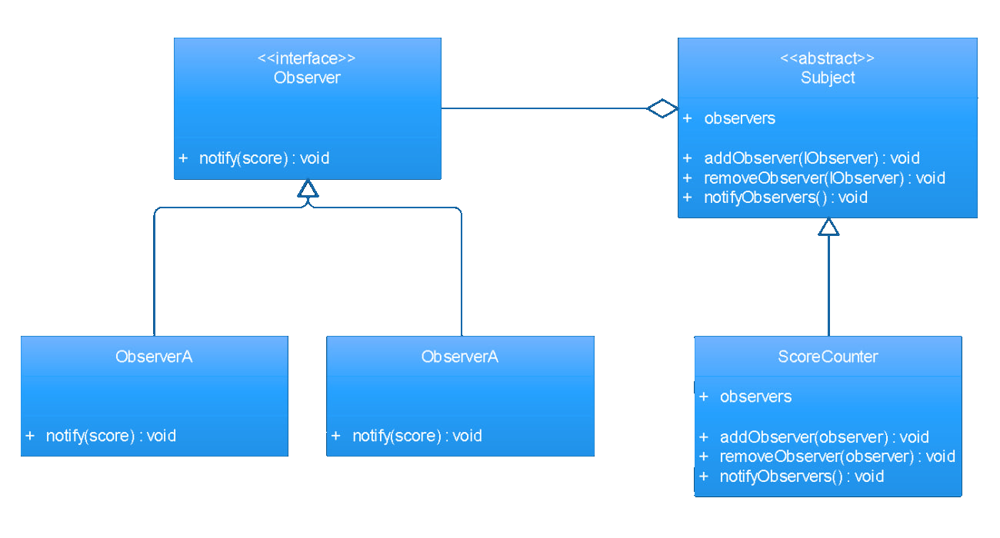

# unity-patterns-examples
Here you will find various examples of how to apply design patterns with Unity in C#

### List of patterns:
- [ ] State
- [ ] Singleton
- [ ] Observer
- [ ] Factory
- [ ] Prototype
- [ ] Command
- [ ] Strategy

## Observer pattern

